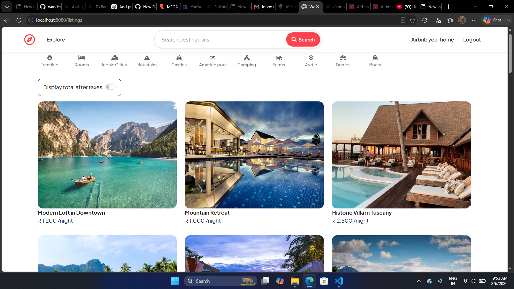
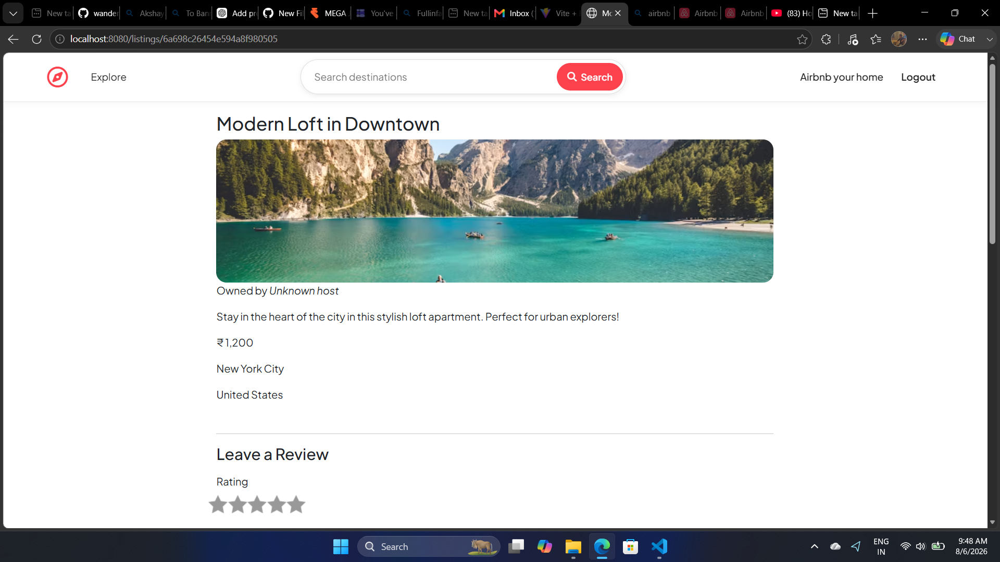
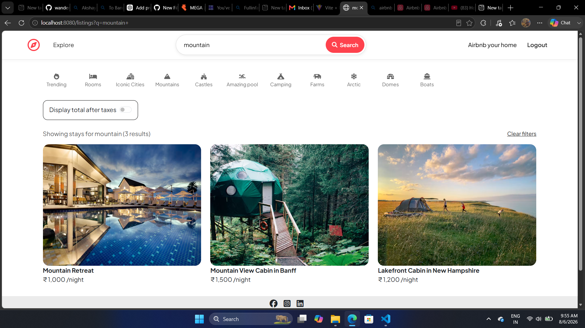
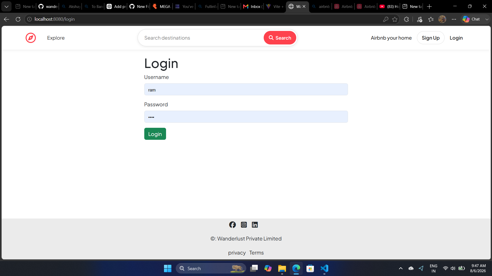

# 🏡 Airbnb 

Airbnb full-stack  web application. Users can explore properties, search by name or destination, create accounts, log in, add property listings, edit listings, upload images, and review accommodations.

## ✨ Features

- Browse property listings
- Search by property name or destination
- User signup, login, and logout
- Create, edit, and delete listings
- Upload and display property images
- Listing details with price, location, and country
- Reviews and ratings
- Authentication and authorization
- Responsive user interface
- Flash messages and error handling
- MongoDB database integration

## 🛠️ Tech Stack

**Frontend:** HTML5, CSS3, JavaScript, Bootstrap, EJS, Font Awesome

**Backend:** Node.js, Express.js

**Database:** MongoDB, Mongoose

**Authentication:** Passport.js, Passport Local, Express Session

**Other Tools:** Cloudinary, Multer, Joi, Connect Flash, Git, GitHub

## 📂 Project Structure

```text
majorproject/
├── controllers/
├── init/
│   ├── data.js
│   └── index.js
├── models/
│   ├── listing.js
│   ├── review.js
│   └── user.js
├── public/
│   ├── css/
│   └── js/
├── routes/
│   ├── listing.js
│   ├── review.js
│   └── user.js
├── utils/
├── views/
│   ├── includes/
│   ├── layouts/
│   ├── listings/
│   └── users/
├── .gitignore
├── app.js
├── package.json
└── README.md
```

## ⚙️ Installation

### 1. Clone the repository

```bash
git clone https://github.com/Shivakumar936/WanderLust.git
```

### 2. Open the project

```bash
cd WanderLust
```

### 3. Install dependencies

```bash
npm install
```

### 4. Configure environment variables

Create a `.env` file in the project root:

```env
ATLASDB_URL=your_mongodb_connection_string
SECRET=your_session_secret

CLOUD_NAME=your_cloudinary_cloud_name
CLOUD_API_KEY=your_cloudinary_api_key
CLOUD_API_SECRET=your_cloudinary_api_secret
```

> Use the exact environment variable names expected by your project.

Make sure `.gitignore` contains:

```gitignore
node_modules/
.env
.env.*
!.env.example
```

> ⚠️ Never upload MongoDB passwords, Cloudinary credentials, API keys, or session secrets to GitHub.

### 5. Initialize sample data

If you want to load the sample listings:

```bash
node init/index.js
```

> ⚠️ Check `init/index.js` first. If it contains `deleteMany({})`, running the seed script may remove existing listings.

### 6. Run the application

```bash
node app.js
```

or, if configured:

```bash
npm start
```

Then open:

```text
http://localhost:8080
```

## 🔐 Authentication

WanderLust uses Passport.js for user authentication.

Users can create an account, log in, log out, create listings, manage authorized listings, and submit property reviews.

## 🔍 Search

The navigation bar provides a search feature for finding listings by property name or destination.

Examples:

```text
Malibu
Cozy Beachfront Cottage
```

## 🖼️ Image Uploads

Property images can be uploaded and stored using Cloudinary, with Multer handling file uploads.

Cloudinary credentials must remain in `.env` and should never be committed to the repository.

## 🗄️ Database

MongoDB is used to store application data including:

- Users
- Property listings
- Reviews
- Locations and prices
- Image information

Mongoose provides schemas and database operations.

## 📸 Screenshots

Create a `screenshots` directory and add your screenshots:

```text
screenshots/
├── home.png
├── listing-details.png
├── search.png
└── login.png
```

### Home Page



### Listing Details



### Search Feature



### Login Page



## 🚀 Future Improvements

- Interactive maps
- Advanced price and location filters
- Wishlist/favorites
- Booking functionality
- User profile dashboard
- Property recommendations
- Pagination
- Availability calendar
- Improved mobile experience

## 👨‍💻 Author

**Shivakumar C**

- GitHub: [Shivakumar936](https://github.com/Shivakumar936)
- LinkedIn: [Shivakumar C](https://www.linkedin.com/in/shivakumar-c-40026a337/)

## ⭐ Support

If you like this project, consider giving the repository a ⭐.

## 📄 License

This project was developed for educational and portfolio purposes.
